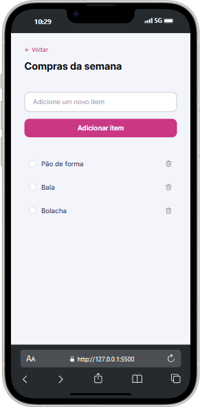
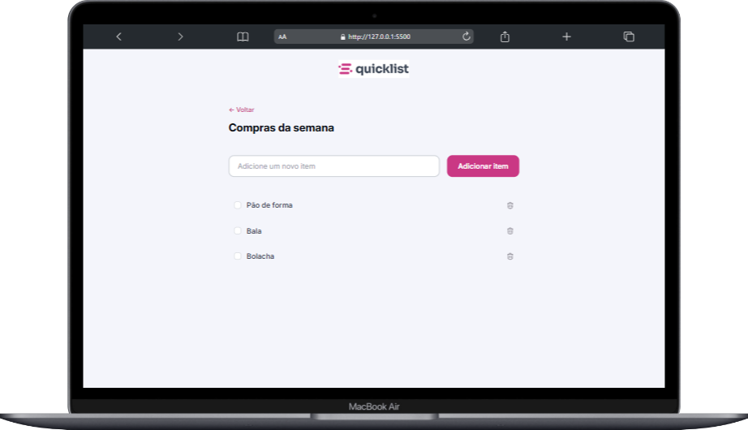

# Quicklist

Este desafio prático foi realizado após o módulo de **Javascrip Básico** da trilha Fullstack da Rocketseat.

Preview do projeto desenvolvido:

<div>
  
  
</div>


## 🛠️ Tecnologias utilizadas
Esse projeto foi desenvolvido com as seguintes tecnologias:
- HTML
- CSS
- Javascript


## 💻 Rodando localmente

Clone o projeto

```bash
  git clone https://github.com/guisalva/rs-fullstack-zingen.git
```

Entre no diretório do projeto

```bash
  cd rs-fullstack-zingen
```


Utilizar o **Live Server** ou abrir o `index.html` com o navegador de sua preferência


## ⚖️ Licença

Este projeto está sob licença [MIT](https://choosealicense.com/licenses/mit/)
